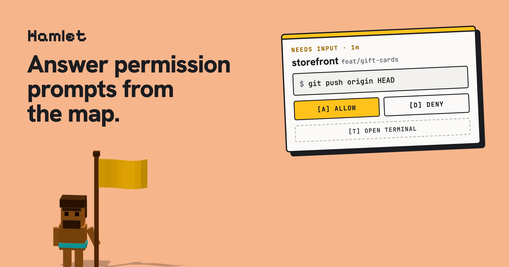
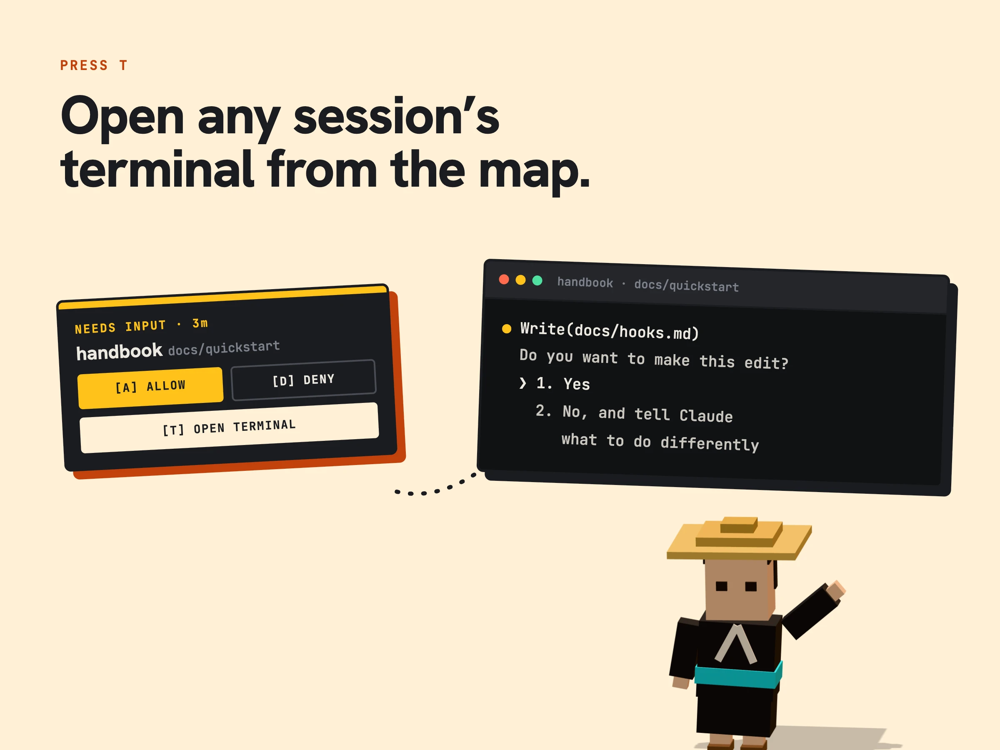
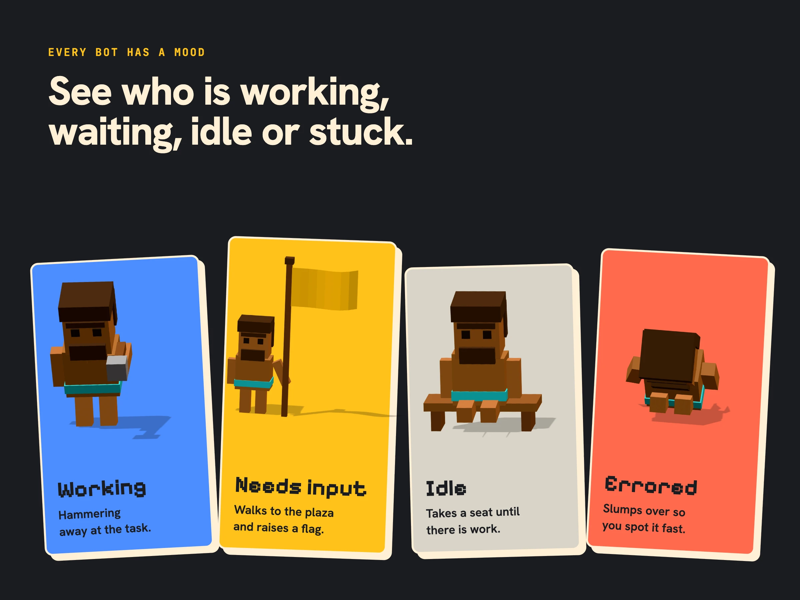
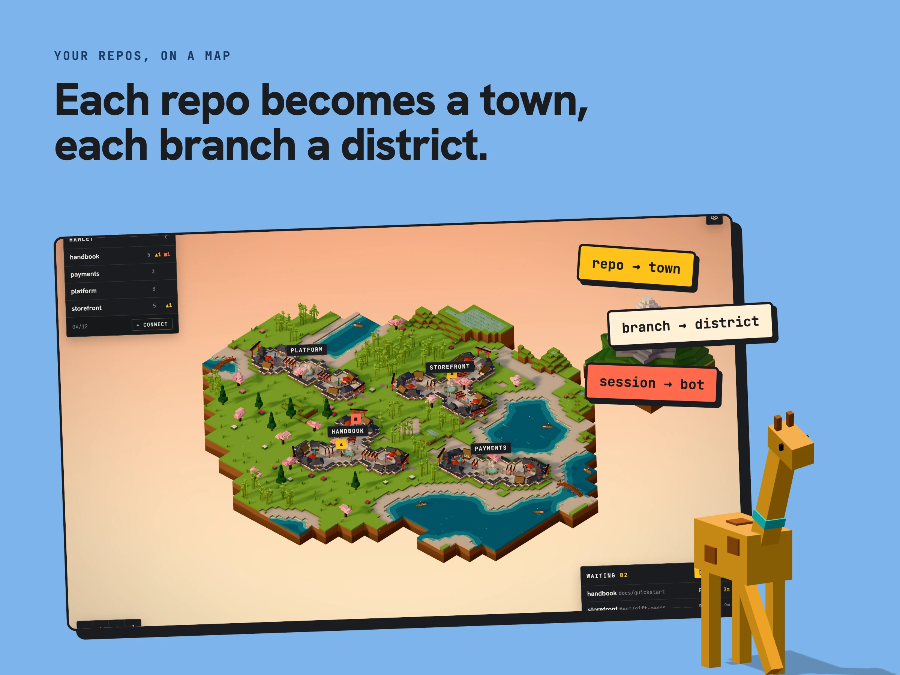
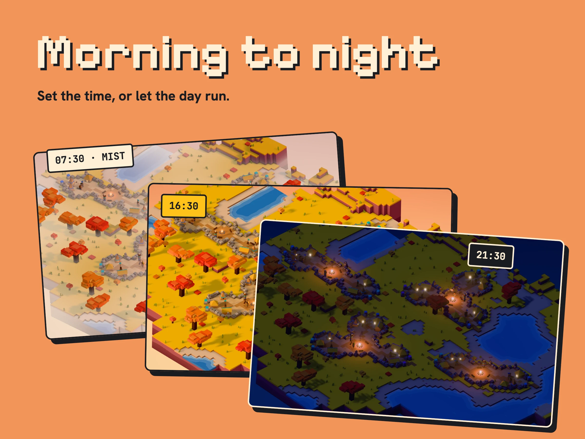
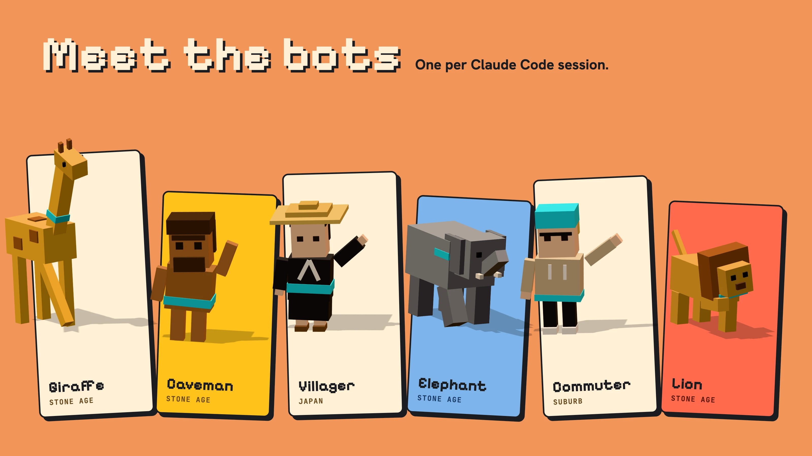
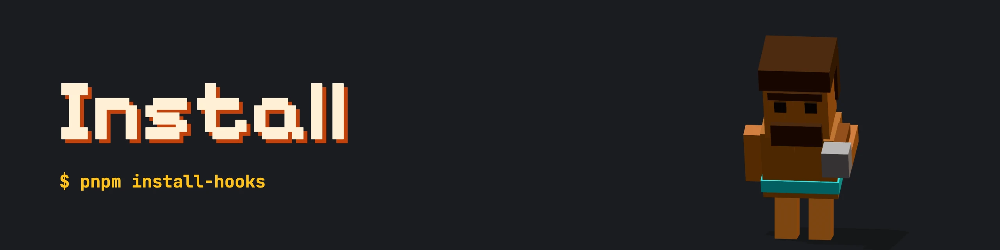
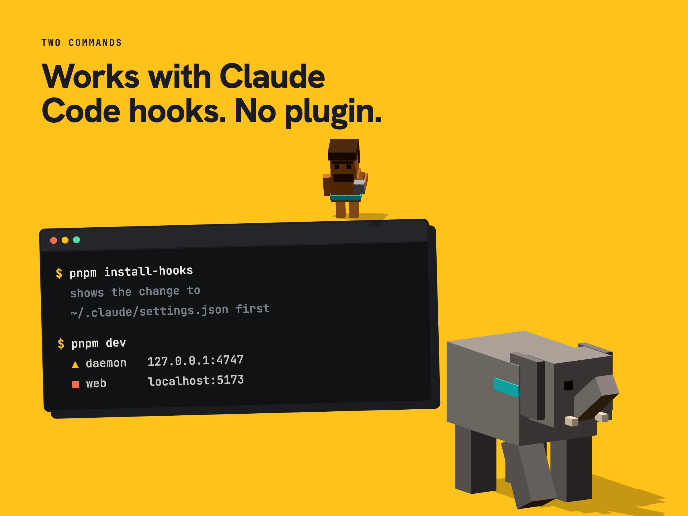

<p align="center">
  
</p>

# Hamlet

A tiny village where your Claude Code sessions live as bots. Hamlet listens to Claude Code's
hooks, shows each session as a bot in a 3D world, and lets you answer permission requests from
the village instead of hunting for the right terminal.

> **Status: early prototype.** Expect rough edges and breaking changes.










Under the hood:

- **`packages/daemon`**: a local server on `127.0.0.1:4747` that receives Claude Code HTTP hook
  events, tracks each session's state, holds `PermissionRequest`s until you answer them, and
  streams updates to the UI.
- **`packages/web`**: the village, rendered with three.js (WebGPU).
- **`packages/installer`**: adds Hamlet's hooks to `~/.claude/settings.json` and removes them again.
- **`packages/shared`**: config, types and constants shared by the other packages.

Everything runs on your machine. Hooks only talk to `127.0.0.1`, and every request is checked
against a random token stored in Hamlet's app-data directory.










### Requirements

- Node.js 22 or newer
- pnpm 8
- [Claude Code](https://claude.com/claude-code)
- A browser with WebGPU support

### Quickstart

```sh
pnpm install
pnpm install-hooks   # shows the change to ~/.claude/settings.json and asks before writing it
pnpm dev             # starts the daemon and the web UI together
```

`pnpm dev` opens Turborepo's terminal UI with one pane per process. Use the arrow keys to switch
panes and open the printed URL from the `web` pane. To answer requests from the terminal, select
the `daemon` pane, press `i` to type into it, and `Ctrl+Z` to leave. You can still run
`pnpm daemon` and `pnpm web` separately.

Start a Claude Code session and a bot appears. Click a bot, or press `N` to jump to the next one
that is waiting. Press `A` / `D` to allow or deny its permission request.

> **Heads up:** `install-hooks` changes your global Claude Code settings. It only adds Hamlet's
> own entries and backs the file up first. If the daemon isn't running, Claude Code treats the
> hook as a non-blocking error and falls back to its normal prompt. To undo the install, run:
>
> ```sh
> pnpm uninstall-hooks
> ```

Hamlet keeps its config and logs in `~/Library/Application Support/hamlet` (macOS),
`%APPDATA%\hamlet` (Windows) or `~/.config/hamlet` (Linux). Set `HAMLET_HOME` to change this.

## Development

```sh
pnpm typecheck
pnpm test
```

Notes from the hook spike are in [`docs/spike.md`](docs/spike.md).

## Contributing

See [CONTRIBUTING.md](CONTRIBUTING.md). Report security issues as described in
[SECURITY.md](SECURITY.md), not in public issues.

## License

[MIT](LICENSE)
